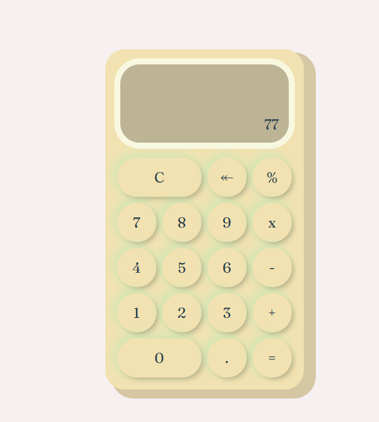

# 🧮 Calculadora Web

Este proyecto es una calculadora simple desarrollada utilizando **HTML**, **CSS** y **JavaScript**. Permite realizar operaciones básicas como suma, resta, multiplicación y división desde el navegador, con una interfaz amigable y funcional.

## 🌐 Demo

👉 [Ver la calculadora en acción](https://tu-url-del-proyecto.com)  
_(Reemplaza esta URL con el enlace real de tu proyecto desplegado)_

## 📌 Características

- Interfaz moderna y responsiva
- Operaciones básicas: suma, resta, multiplicación y división
- Manejo de errores básicos (como división por cero)
- Diseño simple y limpio con CSS

## 🛠️ Tecnologías utilizadas

- **HTML5** – estructura de la aplicación
- **CSS3** – estilos y diseño visual
- **JavaScript** – lógica y funcionalidad de la calculadora

## 🖼️ Captura de pantalla

![Captura de la calculadora]
_(Puedes añadir una imagen de tu proyecto si lo deseas)_

## 🚀 Cómo usar

1. Clona este repositorio:
   ```bash
   git clone https://github.com/GutierrezCesar/Calculadora.git